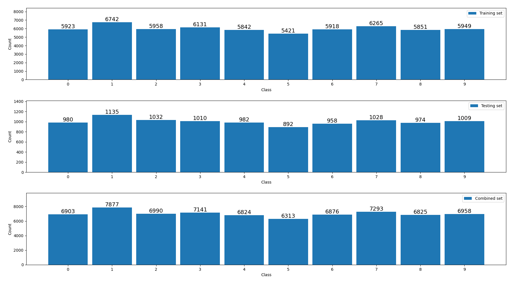

# KIV/ANLP assignment 01

## Implement Training Loop and Experiment with Hyper-Parameters

## Prerequisities

1. Instal PyTorch (https://pytorch.org/)
2. Run Hello world (cpu/gpu)
3. Create account on MetaCentrum

## Tasks

## Our team work [0pt]

Complete missing parts and design clear interface for experimenting.

1. Use python argparser
2. Use wandb and log everything
3. For easy login and testing use environment variable WANDB_API_KEY
4. Run minimalistic hello world on MetaCentrum

## Individual work **[13pt in total]**

### Dataset Analysis **[1pt]**

Create histogram of classes in the dataset.

My answer 

Histograms below show class distribution in training set, test set and distribution of combined training+test set.

### Baseline analysis **[1.5pt]**

How would look accuracy metric for **random model** and **majority class model**(returns only majority class as an output)

My answer 
According to data analysis, the dataset has 10 classes. The dataset is not balanced perfectly, so let's compute the probability of each class <i>cn</i> in combined train+test dataset: 
P(<i>c0</i>) = 6903&frasl;70000 ≈ 0.0987 
P(<i>c1</i>) = 7877&frasl;70000 ≈ 0.1125 
P(<i>c2</i>) = 6990&frasl;70000 ≈ 0.0999 
P(<i>c3</i>) = 7141&frasl;70000 ≈ 0.1020 
P(<i>c4</i>) = 6824&frasl;70000 ≈ 0.0975 
P(<i>c5</i>) = 6313&frasl;70000 ≈ 0.0902 
P(<i>c6</i>) = 6876&frasl;70000 ≈ 0.0982 
P(<i>c7</i>) = 7293&frasl;70000 ≈ 0.1042 
P(<i>c8</i>) = 6825&frasl;70000 ≈ 0.0975 
P(<i>c9</i>) = 6958&frasl;70000 ≈ 0.0994 

Because a random model predicts each class with same probability 1&frasl;10, probability that it predicts any class correctly is 0.1, no matter how big that class is. Let's calculate model accuracy:

<i>accuracy</i> = ∑i P(<i>ci</i>) · 0.1 = 0.1 · ∑i P(<i>ci</i>) = 0.1 · 1 = 0.1

It seems that even though the dataset is not completely balanced, <b>random model still gives 1&frasl;<i>n</i> accuracy for <i>n</i> classes, in our case 10%</b>.

The majority class model would have accuracy equal to probability of the biggest class in data, in our case, class <i>c1</i> is most significant with about 0.1125 prior probability, <b>so the majority class model would do slightly better with accuracy ≈ 0.1125</b>.

Is there any drawback? Can we use something better, why?

My answer 
The main drawback is that these models are very weak — an accuracy of about 10 % is extremely poor. They don't discover any structure in the data and simply make naive predictions.

We can use at least a simple neural network, such as a convolutional model, which already performs much better. More advanced classifiers like transformers can further improve accuracy by learning meaningful relationships between the input images and their labels.

1.  Implement missing fragments in template main01.py
2.  Implement 3-layer MLP with ReLU activation function **CF#Dense**
3.  Run Experiments **[3pt]**

    1.  Run at least 5 experiments with all possible combinations of following hyper-parameters
    2.  Draw parallel coordinates chart and add image output into output section in this README.md

             `model: ["dense", "cnn"]`
             `lr: [0.1, 0.01, 0.001, 0.0001, 0.00001]`
             `optimizer: ["sgd","adam"]`
             `dp: [0, 0.1, 0.3, 0.5]`

    Each experiment train at least for 2 epochs.

4.  Utilize MetaCentrum **[3pt]**

    For HP search modify attached scripts and utilize cluster MetaCentrum.
    https://metavo.metacentrum.cz/

# My results

## Parallel Coordinate Chart with Appropriate Convenient Setup **[0.5pt]**

Draw parallel coordinate chart with all tunned hyper parameters.

1. Show only runs with test_acc < 15 %

My answer 

2. Show only runs that are better than 95% test_acc.

My answer 

 95 %" width="100%">

## Training Progress

1. Show all your runs **[0.5pt]**
   How many are there?

My answer 

If we calculate the Cartesian product of all hyperparameters, we get 80 configurations. We trained each of these configurations five times, so the chart below shows a total of 400 runs.

2. Show only runs with test_acc > 80 **[0.5pt]**
   How many are there?
   What interesting thing can you see there?

My answer 

There are 266 of runs with <i>test_acc</i>&gt;80%. There can be seen multiple interesting relations in image below: <i>dropout</i> level 0.10 is a good choice since many orange lines representing higher <i>test_acc</i> goes through this point, meanwhile dp=0.50 or dp=0.00 is much worse. Applying the same principle, <i>learning rate</i> set to 0.1 is performing well, lr=0.01 is also relatively good, but when we go closer to zero, it's getting worse. Also, CNN model seems to do better than dense model.

 80%" width="100%">

To illustrate the impact of learning rate better, here is the same parallel coordinate chart, but with log-scaled learning rate axis. As it can be seen, lr=1e-5 is performing very poorly.

 80% in log-scale" width="100%">

3. Can you identify non-convergent or divergent runs? **[0.5pt]**

My answer 

These runs can be identified by non-decreasing train loss. So let's set some minimum treshold of train loss and filter only runs with bigger loss than, let's say, 1. Chart below shows, how 10 first selected runs by WANDB evolved in test_acc over time:

It can be seen that test_acc stays in interval &lt;5; 15&gt; for most of the time for these runs. Compared to runs selected from all runs, where test_acc clearly converges:

4. Can you identify runs that are probably convergent but are not appropriately trained to the end? **[0.5pt]**

My answer 

Models trained this way should have some knowledge of data, but this knowledge should not be as big, as we would wish. In other words, the <i>test_acc</i> should be bigger than some threshold because these models learned something, but also lower than another selected threshold. Let's use: 30% &lt; <i>test_acc</i> &lt; 60%. Chart below shows how <i>test_acc</i> evolves over time for these runs:

All of these accuracies are increasing over time, which is a sign, that we stopped the training too much early.

## Table of my results **[1pt]**

1. show 2 best HP configuration (on average) for dense and cnn model
   (both configurations run 5 times and add confidence interval to the table)
2. add random and majority class models into the result table
3. mark as bold in the table

My answer 

I created script <b style="color: #007b80bf;">get_best_configs.py</b>, that calculate the average <i>test_acc</i> for each configuration and outputs this accuracies for 2 best configs when dense/cnn model is used. Table below shows these best resuls and random and majority class model expected results. I used 90 % confidence interval for the error.

<table style="width: 100%;">
<tr style="background: white;">
<th>Model</th>
<th>Optimizer</th>
<th>Dropout</th>
<th>Learning rate</th>
<th>AVG Accuracy ± 90% confidence interval</th>
</tr>
<tr style="text-align: center; background: #DDD;">
<td>CNN</td>
<td>SGD</td>
<td>0.3</td>
<td>0.1</td>
<td>99.24 % ± 0.40 %</td>
</tr>
<tr style="text-align: center; background: #F3F2F3;">
<td>CNN</td>
<td>ADAM</td>
<td>0.1</td>
<td>0.001</td>
<td>99.05 % ± 0.43 %</td>
</tr>
<tr style="text-align: center; background: #DDD;">
<td>Dense</td>
<td>ADAM</td>
<td>0</td>
<td>0.001</td>
<td>97.33 % ± 0.81 %</td>
</tr>
<tr style="text-align: center; background: #F3F2F3;">
<td>Dense</td>
<td>SGD</td>
<td>0</td>
<td>0.1</td>
<td>97.14 % ± 1.24 %</td>
</tr>
<tr style="text-align: center; font-weight: bold; background: #DDD;">
<td colspan="4"><b>Random model</b></td>
<td><b>~ 10.00 %</b></td>
</tr>
<tr style="text-align: center; background: #F3F2F3; font-weight: bold;">
<td colspan="4"><b>Majority class model</b></td>
<td><b>~ 11.25 % </b></td>
</tr>
</table>

## Discussion **[1pt]**

- Discuss the results.
- Try to explain why specific configurations work and other not.
- Try to discuss the most interesting points in your work.
- Is there something that does not make any sense? Write it here with your thoughts.

My answer 

The experiments confirm that convolutional models (CNN) are generally superior to dense models for image data, as they can exploit spatial structure. The best CNN configurations reached over 99 % test accuracy, while the best dense models stayed below 98 %.

Dropout played a significant role: a small amount of dropout (0.1–0.3) helped to regularize the model and avoid overfitting, but too high dropout (0.5) decreased performance. Similarly, learning rate had strong impact: very small learning rates (1e-5) did not allow the model to converge in only a few epochs, while extremely high learning rates led to instability. Mid-range values like 0.001 or 0.1 were good choices.

The most interesting finding is that even very simple dense networks can reach high accuracy (over 97 %), but CNNs still clearly dominate.

There were a few non-convergent runs, mostly with too small learning rate, where accuracy stagnated around 10 %. These serve as a reminder that even “safe” values like 1e-5 can fail completely if training time is too short - the model does not converge due to small changes of parameters (caused by small learning rate) in this case.

Firstly when creating the script for Metacentrum, I had run the training on 1 CPU and the program was executed in about 50 minutes. Then, I also added 1 GPU and the average runtime decreased to 5-8 minutes, which shows how GPU can be beneficial during neural network trainings - I did not expect such a massive improvement.

## Try to explain why specific configurations works better than others.

My answer 

Configurations that combine CNN architecture, medium dropout (0.1–0.3), and properly tuned learning rate (0.1 for SGD, 0.001 for Adam) work the best. CNNs can automatically extract local features from images, which dense networks cannot. The optimal dropout prevents overfitting while still allowing the model to learn effectively.

Runs with too high dropout (like for example 0.5) or too small learning rate (as 1e-5) underperform because the model either discards too much information during training or does not update weights enough to converge within a specified time. This explains why certain configurations give much better results than others, even though they only differ in one hyperparameter.

# Something to think about

1. How to estimate the batch size?
2. What are the consequences of using a larger/smaller batch size?
3. What is the impact of batch size on the final accuracy of the system?
4. What are the advantages/disadvantages of calculating the test on a smaller/larger number of data samples?
5. When would you use such a technique?
6. How to set the number of epochs when training models?
7. Why do the test and train loss start with similar values? Can initial values have any special significance?
8. Is there any reason to set batch_size differently for train/dev/test?
9. When is it appropriate to use learning rate (LR) decay?
