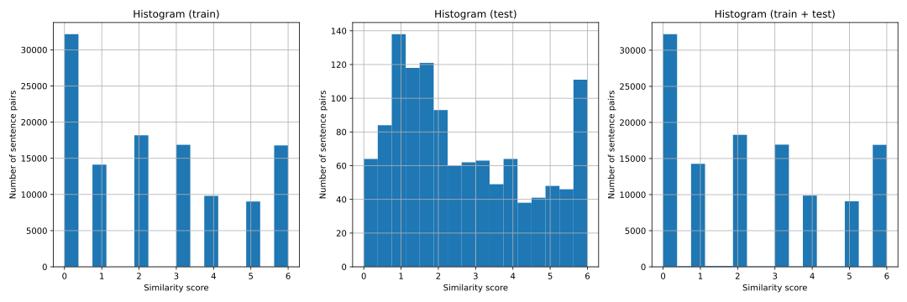
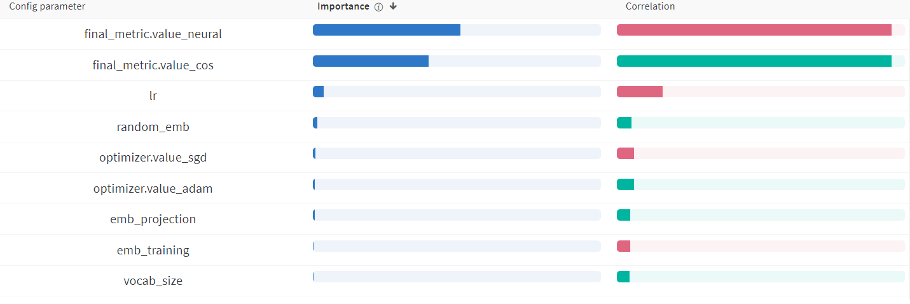
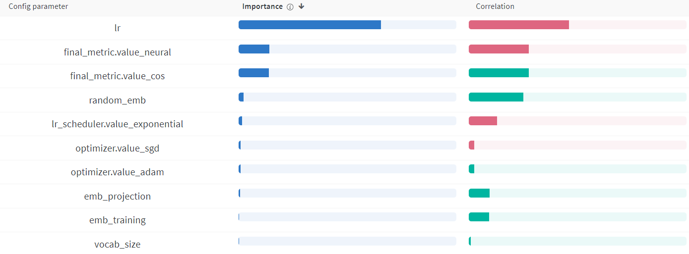

# KIV / ANLP Exercise 02

_Deadline to push results:_ 2024-10-27 23:59:59

_Maximum points:_ 20+5

---

# The Goal

Implement missing parts in the given template of the supervised machine
learning stack for estimating semantic textual similarity (STS). Train and
evaluate it on the given dataset. Use architecture described in the
following section.

# What is Semantic Textual Similarity

Semantic textual similarity deals with determining how similar two
pieces of texts are. This can take the form of assigning a score from 0
to 6 (Our data).

# Project Structure

- [data]
- [tests]
  - _anlp01-sts-free-train.tsv_
  - _anlp01-sts-free-test.tsv_
- _main02.py_

# The Dataset

The dataset was generated during our collaboration with Czech News
Agency - so it is real dataset.

The training part of the dataset contains 116956 samples. Each sample
consists of two sentences and an annotation of their semantic
similarity.

    Příčinu nehody vyšetřují policisté.\tPříčinu kolize policisté vyšetřují.\t4.77

# Tasks \[20+5 points in total\]

### Dataset Statistics **[1pt]**

Create histogram of pair similarity.

**My answer**

Below is shown histogram of train, test and train + test datasets. It can be seen, that train and test datasets differ in score precision: train data has score represented only as integers, while test as float, which I´m confused about.

Present mean and std of the dataset.

**My answer**

| Dataset      | Mean  | Std   |
| ------------ | ----- | ----- |
| Train        | 2.447 | 2.119 |
| Test         | 2.655 | 1.783 |
| Train + Test | 2.449 | 2.116 |

### Baseline analysis **[2pt]**

What would the loss (MSE) of a model returning a random value between 0 and 6 uniformly look like?

**My answer**

Let _ypred_ ~ U(0, 6) be the prediction of this random model and _ytrue_ the expected values (train+test). That means, we want to calculate

MSE(_ypred_, _ytrue_) = E((_ypred_ - _ytrue_)2) =

= E(_ypred_2) - 2E(_ypred_ _ytrue_) + E( _ytrue_2)

To do so, we can calculate:

E(_ypred_) = 3

Var(_ypred_) = (6-0)2&frasl;12 = 3

E(_ypred_2) = Var(_ypred_) + E(_ypred_)2 = 3 + 9 = 12

E(_ytrue_) = 2.449

Var(_ytrue_) = 2.1162 ≈ 4.477

E(_ytrue_2) = Var(_ytrue_) + E(_ytrue_)2 ≈ 4.477 + 5.997 ≈ 10.474

E(_ypred_ _ytrue_) = E(_ypred_) ⋅ E(_ytrue_) = 3 ⋅ 2.449 = 7.347

Now, sice we have all needed intermediate calculations, we can calculate the MSE (the true MSE would reach this value if size of dataset goes to infinity):

MSE(_ypred_, _ytrue_) = E(_ypred_2) - 2E(_ypred_ _ytrue_) + E( _ytrue_2) =

= 12 - 2 ⋅ 7.347 + 10.474 ≈ **7.78**

What would the loss of a model returning best prior (most probable output) look like?

**My answer**

Let's assume that the best prior model always returns _ypred_ = 0, which is the most probable output, as can be seen in the histogram above.
The calculation is then simple:

MSE(_ytrue_, 0) = 1&frasl;_N_ ⋅ ∑_i_ (_ytrue_ - 0)2 = 1&frasl;_N_ ⋅ ∑_i_ _ytrue_2 = E(_ytrue_2)

We already calculated E(_ytrue_2) in previous task:

E(_ytrue_2) ≈ **10.474**

### Implement Dummy Model

1. **Analyze the Dataset**

   #### **CF\#1**

   Count occurrences of words in the datasset, and prepare a list of
   top_n words

   **CKPT\#1**

2. **Prepare Word Embeddings**.
   https://drive.google.com/file/d/1MTDoyoGRhvLf15yL4NeEbpYLbcBlDZ3c/view?usp=sharing

   [//]: # "# https://fasttext.cc/docs/en/crawl-vectors.html"
   [//]: # '# EMB_FILE = "b:/embeddings/Czech (Web, 2012, 5b tokens )/cztenten12_8-lema-lowercased.vec"'

   #### **CF\#2**

   Use the _list of top N words_ for pruning the given Word embeddings.
   The cache will be stored on the hard drive for future use **CF\#3**.

   You should see two new files _word2idx.pckl_ and _vecs.pckl_
   **CKPT\#2**

3. **Implement SentenceVectorizer** This module takes text as an input
   and transforms it into a sequence of vocabulary ids. **CF\#4**

   example:

   Input: Příčinu nehody vyšetřují policisté

   Output: 3215 2657 2366 7063

   **CKPT\#3**

4. **Implement the DataLoader** Implement a Python iterator that loads data from a text file and yields batches of examples. The iterator should handle a dataset stored in the text file and process it in batches as it iterates.

   Use implemented SentenceVectorizer to preprocess the data during
   initialization. **CF\#5** Implement the `__next__` function to
   return a batch of samples. **CF\#6** Shuffle training dataset after
   each epoch **CF\#7**

5. **Implement training loop**

   Implement basic training loop **CF\#8a**. Implement testing for
   model and dataset**CF\#8b**.

6. **Implement DummyModel** DummyModel computes the mean STS value of
   given dataset in the initialization phase and returns this value as
   a prediction independently on model inputs. **CF\#9**

> **[4pt]**

8. **Implement Neural Network Model**

   #### **CF\#10a** **CF\#10b**

   The Model takes two sequences of numbers as an input (Sentence A and
   Sentence B). Use prepared word embeddings (task-2) to lookup word
   vectors from ids. Add one trainable projection layer on top of the
   embedding layer. Use the mean of all words vectors in a sequence as
   a representation of the sequence.

   Concatenate both sequence representations and pass them through two additional fully-connected layers. The final layer contains a single neuron without an activation function. The output represents the value of the STS (Semantic Textual Similarity) measure.

   

9. **Implement Cosine Similarity Measure**

   Change similarity measure implemented with neural network from
   task-7 to cosine similarity measure (cosine of the angle between
   sentA and sentB).

   

> **[4pt]**

10. **Log these:**
    1.  mandatory logged hparams `["random_emb", "emb_training", "emb_projection", "vocab_size", "final_metric", "lr", "optimizer", "batch_size"]`
    2.  mandatory metrics : `["train_loss", "test_loss"]`
11. **Run Experiments with different Hyper-parameters**

    1.  Use randomly initialized embeddings/load pretrained.

        `random_emb = [True, False]`

    2.  Freeze loaded embeddings and do not propagate your gradients into them / Train also loaded embeddings.

        `emb_training = [True, False]`

    3.  Add projection layer right after your Embedding layer.

        `emb_projection = [True, False]`

    4.  Size of loaded embedding matrix pruned by word frequency occurrence in your training data.

        `vocab_size = [20000]`

    5.  Used final metric in two tower model.

        `final_metric = ["cos", "neural"]`

12. **The best performing experiment run at least 10 times** **[2pt]**

13. **Tune More Voluntarily [0-5pt]**
    Add more tuning and HP e.g. LR decay, tune neural-metric head, vocab_size, discuss

    **My answer**

    besides HPs described in the mandatory part, I also used these combinations of further HPs in runs (which had to be implemented anyway, so I've just ran them) -I wanted some more controll in results, as using for example one learning rate seemed very bad choice to me:

`batch_size = [500, 1000]`

`lr = [0.1, 0.01, 0.001, 0.0001, 0.00001]`

`optimizer = ["sgd", "adam"]`

`lr_scheduler = ["step", "multistep", "exponential"]`

`vocab_size = [20000, 30000]` (overwriting `vocab_size = [20000]`)

# My results

## Hyper Parameter Analysis

### Parallel Coordinate Chart **[1pt]**

**My answer**

Since I've tried more hyperparameter setups and had 1920 runs in total (before runing best performing 10 times), I noticed that Wandb is not displaying all of these runs in parallel coordinate chart, but only first _n_. Because of that, I splitted the coordinate chart into two: for _vocab_size_=20 000 and _vocab_size_=30 000 (but these 2 seems to be almost same).

When doing this exercise, I forgot to add LR=1e-5 firstly and only noticed that when I did't pass unit tests. Hovewer, the chart where LR=1e-5 is omited yet can spot some useful knowledge:

From these charts, I clearly see that neural final metric is much better than cosine - also, LR=1e-5 is so bad, that it just makes any other HP seem irelevant for resulting loss. Actually, LR did´t play any significant role in Parameter importance chart that I've created before adding 1e-5 (more on corrected parameter importance with this LR added later):

### Table of my results **[4pt]**

1. list all tuned HP
2. add Dummy model into table
3. present results with confidence intervals (run more experiments with the same config)

**My answer**

Here are all tuned HPs listed:

`random_emb = [True, False]`

`emb_training = [True, False]`

`emb_projection = [True, False]`

`final_metric = ["cos", "neural"]`

`batch_size = [500, 1000]`

`lr = [0.1, 0.01, 0.001, 0.0001, 0.00001]`

`optimizer = ["sgd", "adam"]`

`lr_scheduler = ["step", "multistep", "exponential"]`

`vocab_size = [20000, 30000]`

Let's compare dummy model with my best spotted configurations. The chart below shows the best 4 runs, which had _test_loss_ &lt; 1.7 - after spotting them, I ran these configurations 10 times.

Table below shows the results.

| Configuration | Mean test loss | test loss 90% CI |
| ------------- | -------------- | ---------------- |
| C1            | 1.8052         | (1.7159, 1.8946) |
| C2            | 1.8277         | (1.7766, 1.8789) |
| C3            | 1.9282         | (1.8354, 2.0210) |
| C4            | 2.0125         | (1.8733, 2.1517) |
| **Dummy**     | **3.2301**     | N/A\*            |

\* test loss is 100% accurate

Here are listed each configuration's HPs:

_C1_: batch size=1000, emb projection=true, emb training=false, final metric=neural, lr=0.1, lr scheduler=exponential, optimizer=sgd, random emb=true, vocab size=30000

_C2_: batch size=500, emb projection=true, emb training=true, final metric=neural, lr=0.1, lr scheduler=exponential, optimizer=sgd, random emb=true, vocab size=20000

_C3_: batch size=1000, emb projection=true, emb training=true, final metric=neural, lr=0.1, lr scheduler=exponential, optimizer=sgd, random emb=true, vocab size=30000

_C4_: batch size=500, emb projection=true, emb training=false, final metric=neural, lr=0.1, lr scheduler=step, optimizer=sgd, random emb=true, vocab size=20000

### Discussion **[2pt]**

Which HP I tuned?
Which had the most visible impact?
Did I use another techniques for more stable or better results?

**My answer**

As mentioned earlier, I tuned all these hyperparameters:

`random_emb = [True, False]`

`emb_training = [True, False]`

`emb_projection = [True, False]`

`final_metric = ["cos", "neural"]`

`batch_size = [500, 1000]`

`lr = [0.1, 0.01, 0.001, 0.0001, 0.00001]`

`optimizer = ["sgd", "adam"]`

`lr_scheduler = ["step", "multistep", "exponential"]`

`vocab_size = [20000, 30000]`

which makes 1 920 combinations (plus running best 4 configs 10 times in total).

I already shown how parameter importance looked like before I added LR=1e-5. Then, I was confused by the fact that LR isn't actually important for resulting loss. When adding this problematic LR and properly including all HP combinations, the chart looks like this:

One can notice that final metric is still pretty important, even though most important thing is to set different LR than 1e-5.

# To Think About:

## Practical Question

1. What is the difference between using frozen embeddings with a projection layer and training original embeddings? How is this connected to adding new words to the vocabulary? For example, frequent words in a downstream task that are not present in the embedding file.

1. Compare both similarity measures (Fully-connected, cosine):

   - speed of convergence,

   - behaviour in first epochs,

   - accuracy.

1. Does the size of the effective vocabulary affect the results? How?

1. Have you sped up debugging the system somehow?

1. Can we save some processing time in the final test (10 runs) without
   affecting the results?

1. What is the role of UNK and PAD token in both models?

1. Can you name some hints for improvement of our models?

1. Can we count UNK and PAD into sentence representation average
   embedding? Does it affect the model?

1. What is the problem with output scale with the neural network?

1. What is the problem with output scale with cosine?

1. What is the best vocab size? Why? Task8

1. What is the best learning rate? Why?

1. Which hyper-parameters affect memory usage the most?

## Theoretical Questions

1.  Is it better to train embeddings or not? Why?

2.  Is it important to randomly shuffle the train data, test data? Why?
    When?

3.  What is the reason for comparing MSE on train dataset or testing
    dataset with Mean of training data or mean of testing data?

4.  Can you name similar baselines for other tasks (Sentiment
    classification, NER, Question Answering)?
