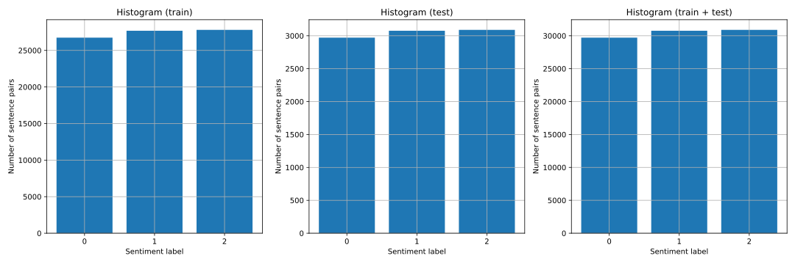
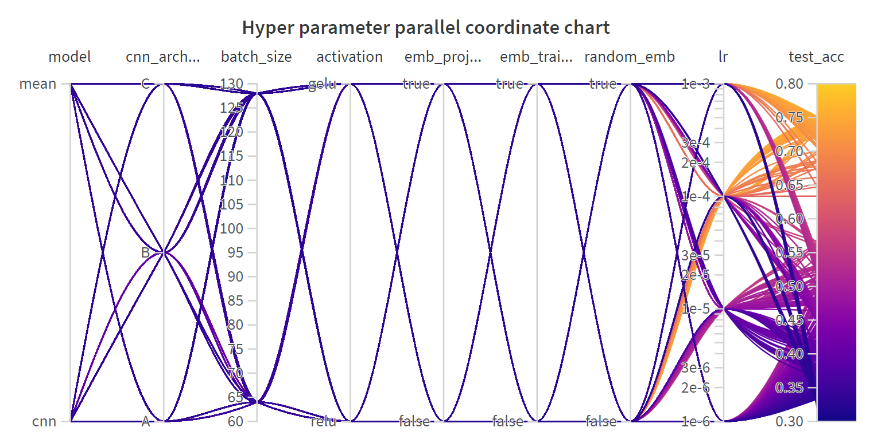
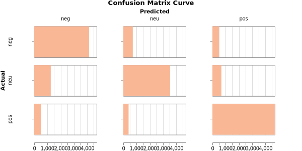
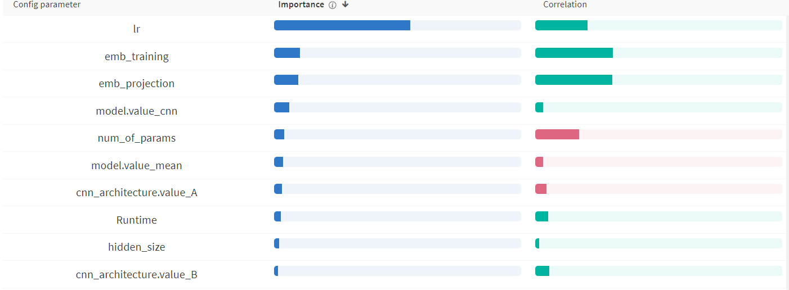
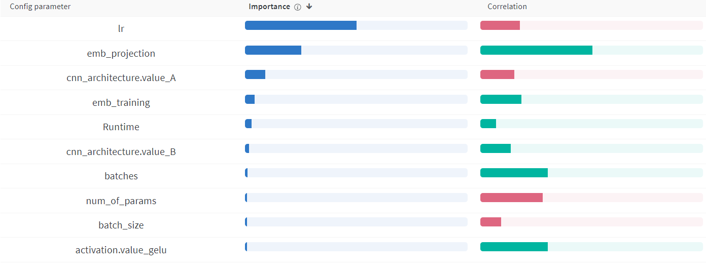

# KIV / ANLP Exercise 03

_Maximum points:_ 20+5

# The Goal

Implement missing parts in the given template of the supervised machine
learning stack for predicting sentiment of given sequence (Sentiment Classification Task).
Train and evaluate the system on the given data set. Use architectures described in the
following section.

# What is Semantic Sentiment Analysis

Varies by domain (most common: 2-3 classification) It is not a dogma...

CSFD Sentiment Czech Dataset (user ranking 0-100%): positive,neutral,negative

# Project Structure

- [tests]
- [data]
  - _csfd-train.tsv_
  - _csfd-test.tsv_
- _main03.py_

# The Data Set

- Your dataset is split : train/test
- Your dataset has labels in tsv
  - negative:0
  - neutral:1
  - positive:2

# Tasks \[20+5 points in total\]

1. **Analyze the Dataset**

**CF\#STATISTICS**

- You can use scripts from Exercise 02 as a starting point.
- Count occurrences of words in the data set, and prepare a list of
  top_n words
- Count statistics about coverage of tokens in training dataset
- Coverage is ratio between tokens you have in your vocabulary and all tokens.
  Do not count pad tokens
- Count statistics about class distribution in dataset (train/test)

**My answer**

Train dataset values seems to be distributed the same way as the test dataset (no bias spotted), almost balanced.



2. **Prepare Word Embeddings**.
   https://drive.google.com/file/d/1MTDoyoGRhvLf15yL4NeEbpYLbcBlDZ3c/view?usp=sharing

[//]: # "# https://fasttext.cc/docs/en/crawl-vectors.html"
[//]: # '# EMB_FILE = "b:/embeddings/Czech (Web, 2012, 5b tokens )/cztenten12_8-lema-lowercased.vec"'

Use the *list of top N word*s for pruning the given Word embeddings.

!! - - IMPORTANT - - !!

**Force vocab size (N most frequent words from the train dataset)
Words without embedding in the given emb file initialize randomly**

The cache will be stored on the hard drive for future use.
You should see two new files _word2idx.pckl_ and _vecs.pckl_

**⚠️ My note**

I had to reimplement _load_ebs_ function from cv02 (new implementation can be found in cv03 main) to fulfill new requirements. This also meant to change import in test.py so that I import new _load_ebs_ function. This is the only thing I changed in tests, as I didn't come with better solution.

Also note that some of runs I created have "activation": "tanh" instead of "gelu" logged by mistake (found later and fixed it), but as long as I've created more runs then neccessery, I still pass all tests.

3. **Prepare Dataset for Training**

Use load_dataset from datasets to load csv dataset.

    from datasets import load_dataset

    cls_dataset = load_dataset("csv", delimiter='\t', data_files={"train": [CSFD_DATASET_TRAIN],
                                                                "test": [CSFD_DATASET_TEST]})

7. **Implement training loop**

   1. Implement basic training loop.
   2. Implement testing for model and dataset

8. **Implement Embedding Averaging Model - Our Baseline**

Implement model which uses average of sequence embeddings to represent the sequence.

The Model takes sequence of numbers as an input [SEQ_LEN]. Use prepared word embeddings (task-2) to lookup word
vectors from ids [SEQ_LEN,EMB_SIZE]. Freeze embeddings. Add one trainable projection layer on top of the
embedding layer [SEQ_LEN,EMB_PROJ]. Use the mean of all words vectors in a sequence as
a representation of the sequence [EMB_PROJ].

Add classification head [NUM_OF_CLASSES].

Primitives to use:

- nn.Embedding
- nn.Softmax
- nn.Linear
- nn.Dropout
- nn.[activation]

**[5pt]**

10. **Implement CNN Model**
    
    For implementing architecture of the model use configuration in form of list,
    where each item correspond to a setup of one layer of the model (prepared in **CF\#CNN_CONF**).

Primitives to use:

- nn.Embedding
- nn.Conv1d, nn.Conv2d
- nn.MaxPool1d, nn.MaxPool2d
- nn.Dropout
- nn.Linear

11. **Log these:**

    MANDATORY_HP = ["activation", "model", "random_emb", "emb_training", "emb_projection", "lr", "proj_size", "batch_size"]
    MANDATORY_HP_CNN = ["cnn_architecture", "n_kernel", "hidden_size"]
    MANDATORY_M = ["train_acc", "test_loss", "train_loss"]

12. **Run Experiments with different Hyper-parameters**

13. **[5pt]** **The best performing experiment run at least 10 times**
    To these runs add special tag : `best`
14. **[5pt]** **Tune More Voluntarily**
    You can use any technique in scope of CNN architecture.
    Best performing CNN gets 5 extra points.
    If confidence intervals of more students overlay, each student gets extra points.

# My results **[5pt]**

## Hyper Parameter Analysis

### Parallel Coordinate Chart

**My answer**

Here is the parallel coordinate chart:



From this picture, we can only see big influance of learning rate: LR 1e-4 and 1e-3 did well, not so 1e-5 and 1e-6. The influance is so big, that other HP values seem to be negliable. More on hyperparameter influance later.

## Confusion matrix -- best run

**My answer**

The best run is <a href="https://wandb.ai/anlp2025/anlp-2025_vladar_dominik/runs/xkytzix9">fanciful-armadillo-4092</a> (with test acc 0.754) and has the following confusion matrix:



### Discussion

Which hyperparameters did I tune?
Which had the greatest influence?
Have I used other techniques to stabilize the training, and did I get better results?

**My answer**

I ran experiments with these HPs values:

```
batch_size = [64, 128]
lr = [0.001 0.0001 0.00001 0.000001]
activation = ["relu", "gelu"]
model = ["cnn", "mean"]
random_emb = [true, false]
emb_training = [true, false]
emb_projection = [true, false]
cnn_architecture = ["A", "B", "C"]
vocab_size=[20000]
seq_len=[100]
batches=[5000]
proj_size=[100]
gradient_clip=[0.5]
n_kernel=[64]
```

Here is parameter importance chart with respect to _test acc_, which I found during last exercise as very useful tool:



It seems that learning rate has the biggest influance (*n*times bigger than the second HP in order, which explains why we couldn't really spot any more relations in hyperparameter coordinate chart). I would actually expect _model_ HP to be the second most important, but it seems that embedding has greater influace on model (maybe just for selected HP values, haven't I made bad selection?).

Let us split parameter importance into 2 scenarios: mean and CNN model. For mean, we got this result:


We see that _emb training_ is now much more important, LR stays the most significant and other HPs are almost negleable.

Now, let's look at CNN architecture.



Here, _emb projection_ is the second most significant HP and _emb training_, on the other hand, isn't so important.

These results make absolute sense: mean model relies heavily on learning embeddings, meanwhile CNN is more dependent on the projection of these embeddings.

My results looked like this - I chose 90 % confidence interval (CI) to represent the uncertainty of results.

<table>
<tr>
<th>
Model
</th>
<th>
Average test accuracy ± CI
</th>
<th>
Test accuracy of "best" runs ± CI
</th>
</tr>
<tr>
<td>Mean</td>
<td>0.495 ± 0.013</td>
<td><b>0.733 ± 0.005</b></td>
</tr>
<tr>
<td>CNN type A</td>
<td>0.474 ± 0.016</td>
<td>0.706 ± 0.002</td>
</tr>
<tr>
<td>CNN type B</td>
<td><b>0.528 ± 0.019</b></td>
<td>0.728 ± 0.004</td>
</tr>
<tr>
<td>CNN type C</td>
<td>0.499 ± 0.020</td>
<td>0.725 ± 0.002</td>
</tr>
</table>

All of these models had very similar accuracy, which was very suprising finding.

# To Think About:

## Practical Question

1.  Compare both similarity measures (Fully-connected, cosine):

    - speed of convergence,

    - behaviour in first epochs,

    - accuracy.

2.  Does the size of the effective vocabulary affect the results? How?

3.  Have you sped up debugging the system somehow?

4.  Can we save some processing time in the final test (10 runs) without
    affecting the results?

5.  What is the role of UNK and PAD token in both models?

6.  Can you name some hints for improvement of our models?

7.  Can we count UNK and PAD into sentence representation average
    embedding? Does it affect the model?

8.  What is the problem with output scale with the neural network?

9.  What is the problem with output scale with cosine?

10. What is the best vocab size? Why? Task8

11. What is the best learning rate? Why?

12. Which hyper-parameters affect memory usage the most?

## Theoretical Questions

1.  Is it better to train embeddings or not? Why?

2.  Is it important to randomly shuffle the train data, test data? Why?
    When?

3.  What is the reason for comparing MSE on train dataset or testing
    dataset with Mean of training data or mean of testing data?

4.  Can you name similar baselines for other tasks (Sentiment
    classification, NER, Question Answering)?
