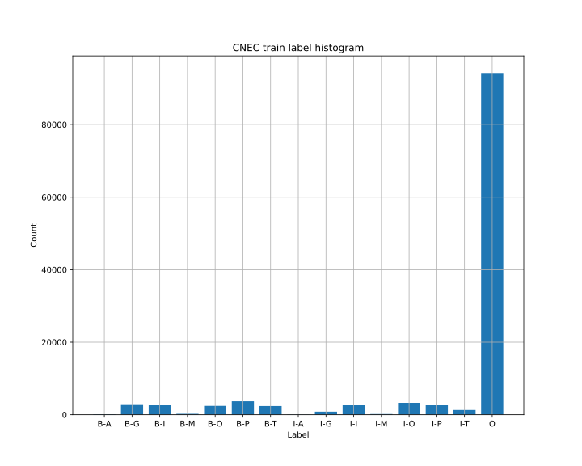
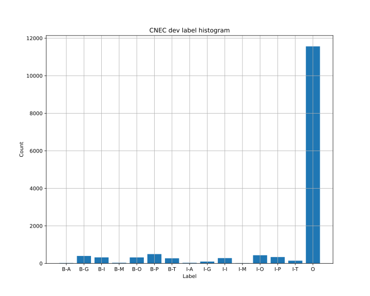
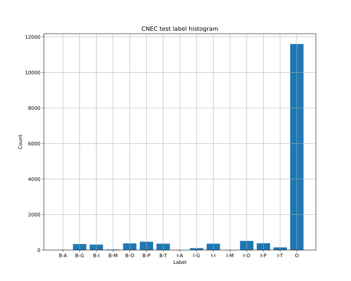
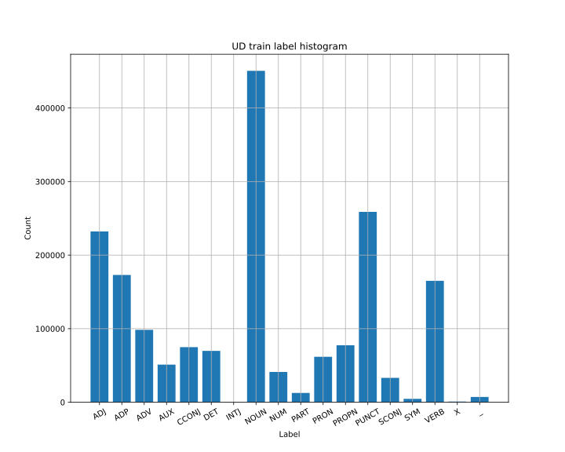
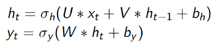
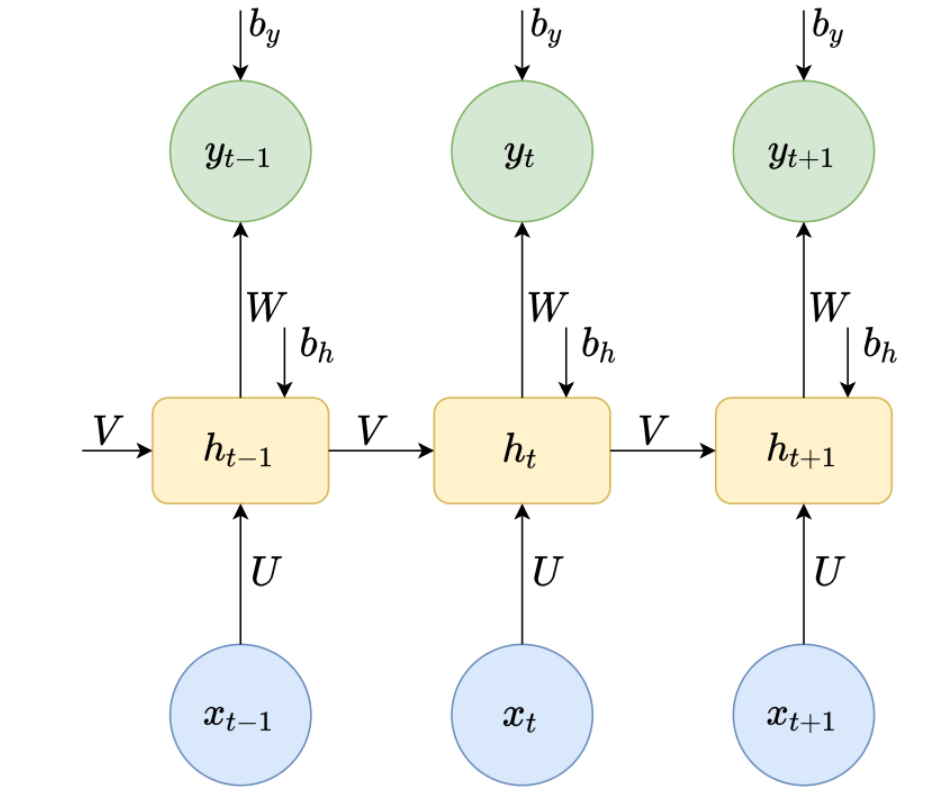
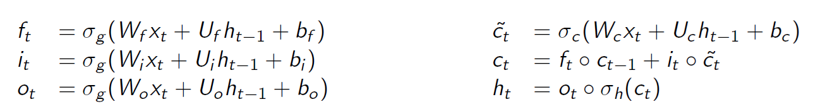
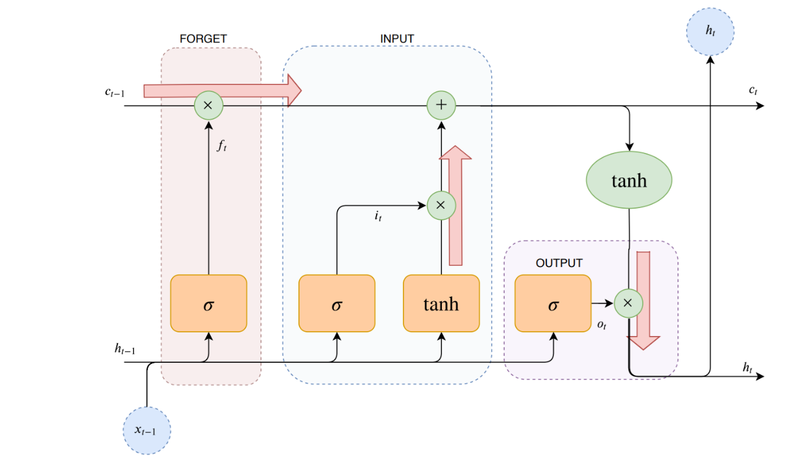
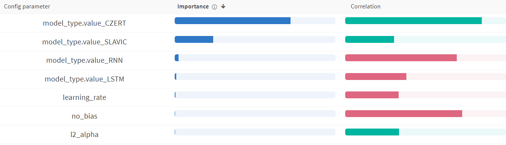
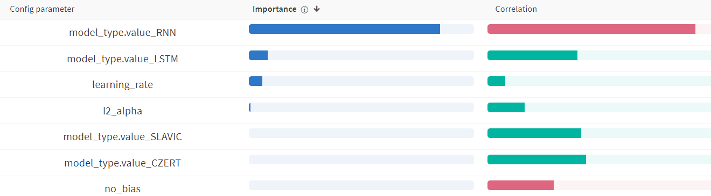

# CV04 - Named Entity Recognition/Morphological Tagging

**Maximum points:** 20 + 5 (bonus)

**Contact:** Feel free to drop me an email or come to the next lesson
to discuss your problems. I'm also open to schedule online session in the meantime if you need
any support.

## Problem statement:

In this assignment you'll practice the RNN/LSTM-based neural networks for token classification
on two different tasks. The first task will be NER (Named Entity Recognition) and the second will be Morphological Tagging.

**What is NER:** Named entity recognition (NER) is the task of tagging entities in text with
their corresponding type. Approaches typically use BIO notation, which differentiates the
beginning (B) and the inside (I) of entities. O is used for non-entity tokens.
[NER Wiki](https://en.wikipedia.org/wiki/Named-entity_recognition)

**What is Morphological Tagging:** Morphological tagging is the task of assigning labels to a sequence of
tokens that describe them morphologically. As compared to Part-of-speech tagging,
morphological tagging also considers morphological features, such as case, gender or the tense of verbs.

To do so, we will use two datasets that are already pre-processed and ready to use
(including the data input pipeline). The first dataset is the [CNEC](https://ufal.mff.cuni.cz/cnec) (Czech Named Entity Corpus)
and is designated for the NER task. The second utilized dataset is the [UD](https://universaldependencies.org) (Universal Dependencies) -
Czech treebanks only. Both corpora are pre-processed to have the same format using labels in [BIO](<https://en.wikipedia.org/wiki/Inside–outside–beginning_(tagging)>) notation.

_In addition to the RNN and LSTM models, you will have a change to run some experiments with
BERT-like models (CZERT and Slavic) that are pre-trained for Czech and Slavic languages, respectively.
Thanks to that you will be able to understand the strength of the large pre-trained models._

## Project Structure

- [data] - data for NER task (do not touch)
- [data-mt] - data for Tagging task (do not touch)
- [test] - unittest to verify your solutions (do not touch)
- main04.py - main source code of the assignment, training loops, etc.
- models.py - implementation of all models
- ner_utils.py - data input pipeline, etc. (do not touch)
- README.md

## Tasks:

### CKPT1 (Dataset Analysis)

Analyse the dataset - write the results into the discussion (secion 1). Answer all the following questions:

1. What labels are used by both datasets - write a complete list and explanation of the labels (use the referenced dataset websited).
2. How large are the two datasets (train, eval, test, overall).
3. What is the average length of a training example for the individual datasets - in number of whole words tokens as pre-tokenized in the dataset files.
4. What is the average length of a token for the individual datasets - in number of subword tokens when using `tokenizer = transformers.BertTokenizerFast.from_pretrained("UWB-AIR/Czert-B-base-cased")` - documentation: https://huggingface.co/docs/transformers/main_classes/tokenizer#transformers.PreTrainedTokenizer (methods: encode or batch_encode).
5. Count statistics about class distribution in dataset (train/dev/test) for the individual datasets.
6. Based on the statistic from the questions above - are the individual datasets balanced or unbalanced? In case at least one of the dataset is unbalanced, are there any implications for the model/solution or is there anything we should be aware of?

**[3 pt]** - Evaluation method: manually (each question 0.5pt)

### CKPT2 (RNN Model)

_Note: During the whole implementation, preserve the attribute/variable names if suggested (e.g. `self.__dropout_layer = ...` -> `self.__dropout_layer = torch.nn.Dropout(p=self.__dropout_prob)`. If you change the name of such variables, the tests will be failing._

_Note: When implementing the models, mind the constructor params. All the parameters shall be employed by the model and the model shall adapt it's functionality based on the provided arguments (some parameters may be used in later steps as well -> no panic if you don't use them right now)._

1. State the equations used for computing the activations of an RNN model in the discussion (section 2).
2. Implement an RNN model with the allowed torch primitives only:

- Allowed:
  - torch.nn.Embedding
  - torch.nn.Dropout
  - torch.nn.Linear
  - torch.nn.CrossEntropyLoss
  - all torch functions (e.g. tensor.view(), torch.tanh(), torch.nn.functional.Softmax(), etc...)
- Not allowed:
  - torch.nn.Rnn
  - torch.nn.GRU
- Architecture Description:
  - Inputs (come into the model tokenized using subword tokenizer) are embedded using an embedding layer.
  - Dropouts applied on the embedded sequence.
  - Sequence of hidden states is computed sequentially in a loop using one `torch.Linear` layer with `torch.tanh` activation (you have to save all the hidden states for later)
    - Hint: make sure you make a deep copy of the hidden state tensor preserving the gradient flow (`tensor.clone()`)
  - Dropout is applied to the sequence of hidden states
  - Compute output activations
  - Compute loss and return instance of `TokenClassifierOutput` (_Note: the loss is computed in the forward pass and returned in the `TokenClassifierOutput` to unify interface of our custom models with HuggingFace models_.)

3. Do a step by step debugging to ensure that the implementation works as expected - check the dimensionality of tensors flowing through the model (no points for that, but it is important for the experiments that the model works correctly)

**[4 pt]** - Evaluation method: passing unittests for ckpt2 (3.5pt), discussion manually (0.5pt)

### CKPT3 (LSTM Model)

_Note: During the whole implementation, preserve the attribute/variable names if suggested (e.g. `self.__dropout_layer = ...` -> `self.__dropout_layer = torch.nn.Dropout(p=self.__dropout_prob)`. If you change the name of such variables, the tests will be failing._

_Note: When implementing the models, mind the constructor params. All the parameters shall be employed by the model and the model shall adapt it's functionality based on the provided arguments (some parameters may be used in later steps as well -> no panic if you don't use them right now)._

1. State the equations used for computing the activations of an LSTM model in the discussion and explain the individual gates (their purpose) (section 3).
2. Implement an LSTM model with any possible primitives :

- Suggested:
  - torch.nn.Embedding
  - torch.nn.Dropout
  - torch.nn.Linear
  - torch.nn.LSTM
  - torch.nn.CrossEntropyLoss
  - all torch functions (e.g. tensor.view(), torch.tanh(), torch.nn.functional.Softmax(), etc...)
- Architecture Description:
  - Inputs (come into the model tokenized using subword tokenizer) are embedded using an embedding layer.
  - Dropouts applied on the embedded sequence.
  - **Bi**LSTM layer with parameterizable number of layers is used to process the embedded sequence.
  - Dropout is applied to the sequential output of the LSTM layers
  - A dense layer with ReLu activation is applied
  - A classification head with softmax activation is applied to compute output activations
  - Compute loss and return instance of `TokenClassifierOutput` (_Note: the loss is computed in the forward pass and returned in the `TokenClassifierOutput` to unify interface of our custom models with HuggingFace models_.)

3. Do a step by step debugging to ensure that the implementation works as expected - check the dimensionality of tensors flowing through the model (no points for that, but it is important for the experiments that the model works correctly)

**[3 pt]** - Evaluation method: passing unittests for ckpt3 (2.5pt), discussion manually (0.5pt)

### CKPT4 (Freezing Parameters & L2 Regularization)

1. Implement a possibility to freeze an embedding layer of the RNN and LSTM model - it means that the embedding layer (that we alway init randomly) will not be trained at all.
   - method `self.__freeze_embedding_layer()` - for both models
2. Implement the following methods:
   - `compute_l2_norm_matching` - compute an L2 norm of all model parameters matching a pattern from a given list of patterns (python built-it function `any()` can be useful)
3. Implement `compute_l2_norm` method for both RNN and LSTM model and return the L2 scaled with the `self.__l2_alpha`. Use the previously implemented method
   - RNN: regularize only the dense layer for computing the new hidden state and the classification head
   - LSTM: regularize only the dense layer and classification head
4. In the discussion (section 4) explain in which case do we want to freeze the embedding layer. Also discuss whether it is useful to freeze embedding layer in our case when we initialize the embedding layer randomly - would you expect the model to work well with the frozen randomly initialized embedding layer?

**[3 pt]** - Evaluation method: passing unittest for ckpt4 (2pt), discussion manually (1pt)

### CKPT5 (Training loop & LR schedule)

_Note: During the whole implementation, preserve the attribute/variable names if suggested (e.g. `self.__dropout_layer = ...` -> `self.__dropout_layer = torch.nn.Dropout(p=self.__dropout_prob)`. If you change the name of such variables, the tests will be failing._

1. Read through the training loop and understand the implementation. Check the usage of `scheduler` variable. (not evaluated by us, but helpful for you)
2. Implement `lr_schedule()` - LR scheduler with linear warmup during first `warmup_steps` training steps and linear decay to zero over the whole training.
   - The scheduler shall return number in [0, 1] - resulting LR used by the model is `training_args.learning_rate * lr_schedule()`
3. In the discussion (section 5) discuss why such LR scheduler can help to improve results. Discuss both the warmup and decay separately.

**[2 pt]** Evaluation method: passing unittests for ckpt5 (1pt), discussion manually (1pt)

### CKPT6 (Basic Experiments)

1. NER experiments with RNN and LSTM
   - Some hyperparameters to start with:
     - RNN
       - ```shell
          main04.py \
            --per_device_train_batch_size 8 \
            --per_device_eval_batch_size 8 \
            --model_type RNN \
            --data_dir data \
            --labels data/labels.txt \
            --output_dir output \
            --do_predict \
            --do_train \
            --do_eval \
            --eval_steps 200 \
            --logging_steps 50 \
            --learning_rate 0.0001 \
            --warmup_steps 4000 \
            --num_train_epochs 1000 \
            --no_bias \
            --dropout_probs 0.05 \
            --l2_alpha 0.01 \
            --lstm_hidden_dimension 64 \
            --num_lstm_layers 2 \
            --embedding_dimension 128 \
            --task NER
         ```
     - LSTM
       - ```shell
         main04.py \
            --model_type LSTM \
            --data_dir data \
            --labels data/labels.txt \
            --output_dir output \
            --do_predict \
            --do_train \
            --do_eval \
            --eval_steps 200 \
            --eval_dataset_batches 200 \
            --logging_steps 50 \
            --learning_rate 0.0001 \
            --warmup_steps 4000 \
            --num_train_epochs 1000 \
            --no_bias \
            --dropout_probs 0.05 \
            --l2_alpha 0.01 \
            --lstm_hidden_dimension 128 \
            --num_lstm_layers 2 \
            --embedding_dimension 128
         ```
   - Run at least one experiment with the following hyperparameters changed:
     - use `--no_bias`/don't use `--no_bias`
     - LR: {0.0001, 0.001} (`--learning_rate`)
     - L2 alpha: {0.01, 0} (`--l2_alpha`)
     - It means that you will have at least 6 runs for each model - always use the base hyperparameters and then change just the one
2. TAGGING experiments with RNN and LSTM
   - Some hyperparameters to start with:
     - RNN
       - ```shell
          main04.py \
            --model_type RNN \
            --data_dir data-mt \
            --labels data-mt/labels.txt \
            --output_dir output \
            --do_predict \
            --do_train \
            --do_eval \
            --eval_steps 300 \
            --eval_dataset_batches 200 \
            --logging_steps 50 \
            --learning_rate 0.0001 \
            --warmup_steps 4000 \
            --num_train_epochs 10 \
            --no_bias \
            --dropout_probs 0.05 \
            --l2_alpha 0.01 \
            --lstm_hidden_dimension 128 \
            --num_lstm_layers 2 \
            --embedding_dimension 128 \
            --task TAGGING
         ```
     - LSTM
       - ```shell
          main04.py \
            --per_device_train_batch_size 8 \
            --per_device_eval_batch_size 8 \
            --model_type LSTM \
            --data_dir data-mt \
            --labels data-mt/labels.txt \
            --output_dir output \
            --do_predict \
            --do_train \
            --do_eval \
            --eval_steps 300 \
            --logging_steps 50 \
            --learning_rate 0.0001 \
            --warmup_steps 4000 \
            --num_train_epochs 10 \
            --no_bias \
            --dropout_probs 0.05 \
            --l2_alpha 0.01 \
            --lstm_hidden_dimension 128 \
            --num_lstm_layers 2 \
            --embedding_dimension 128 \
            --task TAGGING
         ```
   - Run at least one experiment with the following hyperparameters changed:
     - use `--no_bias`/don't use `--no_bias`
     - LR: {0.0001, 0.001} (`--learning_rate`)
     - L2 alpha: {0.01, 0} (`--l2_alpha`)
     - It means that you will have at least 6 runs for each model - always use the base hyperparameters and then change just the one
3. CZERT and Slavic
   - One experiment with each model for each task (4 runs in total) - hyperparameters provided below:
     - NER
       - CZERT
         - ```shell
             main04.py \
               --per_device_train_batch_size 32 \
               --per_device_eval_batch_size 32 \
               --model_type CZERT \
               --data_dir data \
               --labels data/labels.txt \
               --output_dir output \
               --do_predict \
               --do_train \
               --do_eval \
               --eval_steps 100 \
               --logging_steps 50 \
               --learning_rate 0.0001 \
               --warmup_steps 4000 \
               --num_train_epochs 50 \
               --dropout_probs 0.05 \
               --l2_alpha 0.01 \
               --task NER
           ```
       - SLAVIC
         - ```shell
             main04.py \
               --per_device_train_batch_size 32 \
               --per_device_eval_batch_size 32 \
               --model_type SLAVIC \
               --data_dir data \
               --labels data/labels.txt \
               --output_dir output \
               --do_predict \
               --do_train \
               --do_eval \
               --eval_steps 100 \
               --logging_steps 50 \
               --learning_rate 0.0001 \
               --warmup_steps 4000 \
               --num_train_epochs 50 \
               --dropout_probs 0.05 \
               --l2_alpha 0.01 \
               --task NER
           ```
     - TAGGING
       - CZERT
         - ```shell
            main04.py \
             --per_device_train_batch_size 32 \
             --per_device_eval_batch_size 32 \
             --model_type CZERT \
             --data_dir data-mt \
             --labels data-mt/labels.txt \
             --output_dir output \
             --do_predict \
             --do_train \
             --do_eval \
             --eval_steps 300 \
             --logging_steps 50 \
             --learning_rate 0.0001 \
             --warmup_steps 4000 \
             --num_train_epochs 10 \
             --dropout_probs 0.05 \
             --l2_alpha 0.01 \
             --task TAGGING
           ```
       - SLAVIC
         - ```shell
           main04.py \
             --per_device_train_batch_size 32 \
             --per_device_eval_batch_size 32 \
             --model_type SLAVIC \
             --data_dir data-mt \
             --labels data-mt/labels.txt \
             --output_dir output \
             --do_predict \
             --do_train \
             --do_eval \
             --eval_steps 300 \
             --logging_steps 50 \
             --learning_rate 0.0001 \
             --warmup_steps 4000 \
             --num_train_epochs 10 \
             --dropout_probs 0.05 \
             --l2_alpha 0.01 \
             --task TAGGING
           ```
4. Discussion for NER - compare results of the individual models and try to explain why the models achieve the results you observed. Specifically compare the results achieved with RNN/LSTM and CZERT/Slavic.
5. Discussion for TAGGING - compare results of the individual models and try to explain why the models achieve the results you observed. Specifically compare the results achieved with RNN/LSTM and CZERT/Slavic.

**[5 pt]** Evaluation method: passing unittests for ckpt6 (3pt), discussion manually (2pt) - it is not possible to get any points for the passing unittests if discussion is missing at this CKPT

### CKPT7 (Extended experiments)

1. Use the same hyperparameters for CZERT model as above and make additional experiments with the following hyperparameters on NER:
   - Freeze embedding layer and train the model - do you observe any difference in the achieved results?
   - Freeze first {2, 4, 6} layers of the CZERT model + freeze embeddings - do you observe any difference in the achieved results?
2. Adjust `main04.py` to enable to train another model `BERT` - simple change after line `243` and you can use the Czert model implementation and just provide a different model name. For this experiment, use the `bert-base-cased` (https://huggingface.co/bert-base-cased?text=Paris+is+the+%5BMASK%5D+of+France.).
   - If you choose to implement this bonus, please use `--model_type BERT` so that unittest can recognize that correctly.
   - This experiment is a test of how well does a pre-trained model for English perform on a Czech tasks.
   - Run at least 5 experiments with different hyperparameters for each task (use MetaCentrum for that). Make sure you've run enough epochs to enable model to converge.
3. Discuss the results of both subtasks and also answer the following questions:
   - Does the model with frozen embeddings perform worse than the model with trainable embeddings?
   - Do you see any result improvement/impairment when freezing the lower layers of the CZERT model?
   - Does freezing the lower layers bring any benefits in term of results, speed of training, etc?
   - Does the BERT model work for Czech tasks? State the results and include a graph of eval metrics for the BERT model config for both tasks.

**[5pt]** Evaluation method: passing unittests for ckpt7 (3pt), discussion manually (2pt)

## Discussions

### Section 1 - Dataset Analysis

**My answer**

1. What labels are used by both datasets - write a complete list and explanation of the labels (use the referenced dataset websited).

CNEC dataset:

---

B-A = Beginning of Numbers in addresses

B-G = Beginning of Geographical names

B-I = Beginning of Institutions

B-M = Beginning of Media names

B-O = Beginning of Artifact names

B-T = Beginning of Time expressions

B-P = Beginning of Personal names

I-A = Inside of Numbers in addresses

I-G = Inside of Geographical names

I-I = Inside of Institutions

I-M = Inside of Media names

I-O = Inside of Artifact names

I-P = Inside of Personal names

I-T = Inside of Time expressions

O = Outside of a named entity

---

UD dataset:

---

ADJ = Adjective

ADP = Adposition

ADV = Adverb

AUX = Auxiliary verb

CCONJ = Coordinating conjunction

DET = Determiner

INTJ = Interjection

NOUN = Noun

NUM = Numeral

PART = Particle

PRON = Pronoun

PROPN = Proper noun

PUNCT = Punctuation

SCONJ = Subordinating conjunction

SYM = Symbol

VERB = Verb

X = Other

\_ = Probably "not labeled"

---

2. How large are the two datasets (train, eval, test, overall).

Count of senteces in CNEC dataset:

---

train: 4688

dev: 577

test: 585

overall(train+dev+test): 5850

---

Count of senteces in UD dataset:

---

train: 103143

dev: 11326

test: 12216

overall(train+dev+test): 126685

---

3. What is the average length of a training example for the individual datasets - in number of whole words tokens as pre-tokenized in the dataset files.

Avg length of example in words in CNEC dataset:

---

train: 25.53

dev: 25.64

test: 25.75

overall(train+dev+test): 25.56

---

Avg length of example in words in UD dataset:

---

train: 17.58

dev: 16.99

test: 16.89

overall(train+dev+test): 17.46

---

4. What is the average length of a token for the individual datasets - in number of subword tokens when using `tokenizer = transformers.BertTokenizerFast.from_pretrained("UWB-AIR/Czert-B-base-cased")` - documentation: https://huggingface.co/docs/transformers/main_classes/tokenizer#transformers.PreTrainedTokenizer (methods: encode or batch_encode).

In CNEC dataset:

---

train: 35.53

dev: 35.76

test: 36.05

overall(train+dev+test): 35.61

---

In UD dataset:

---

train: 23.37

dev: 22.42

test: 22.30

overall(train+dev+test): 23.18

---

5. Count statistics about class distribution in dataset (train/dev/test) for the individual datasets.

CNEC dataset:





UD dataset:




6. Based on the statistic from the questions above - are the individual datasets balanced or unbalanced? In case at least one of the dataset is unbalanced, are there any implications for the model/solution or is there anything we should be aware of?

The CNEC dataset is heavily imbalanced (79% of all labels is O (other) in train dataset for example). Even though UD dataset does not have such majority class and looks much more balanced, it isn't perfectely balanced at all, but it should not be a big problem for model in this case.

Imbalanced dataset may result in model, which learns only to predict majority class/es and omit not so frequent ones. One way to handle this is to penalize model when it does not predict the correct minority class much more than if it does not correctly predict the majority class, but this may also lead to predicting the minority class more than we would like to, so there is both down and upside. On the other hand, if we just let the model be, we could see 79% correct predictions and think how the model is good, yet the model could just collapse into majority class predictor and always return "O" label.

Because of this, we should watch more metrics then just accuracy to be sure, that model actually learns something.

### Section 2 - RNN Model

**My answer**

1. State the equations used for computing the activations of an RNN model in the discussion (section 2).



Where

<code>h<sub>t<sub></code> is current hidden state;

<code>σ<sub>h</sub></code> hidden state activation function;

<code>U</code> weight matrix for the input;

<code>x<sub>t</sub></code> current input;

<code>V</code> weight matrix for the previous hidden state;

<code>h<sub>t-1</sub></code> the previous hidden state;

<code>b<sub>h</sub></code> hidden state bias;

<code>y<sub>t</sub></code> output in current state;

<code>σ<sub>y</sub></code> output activation function;

<code>W</code> weight matrix for the hidden state;

<code>h<sub>t</sub></code> current hidden state;

<code>b<sub>y</sub></code> output bias.

This can be better understood using diagram below (from lecture slides):



### Section 3 - LSTM Model

**My answer**

1. State the equations used for computing the activations of an LSTM model in the discussion and explain the individual gates (their purpose) (section 3).

These are the equations we need:



Where

<code>○</code> is element-wise multiplication;

<code>f<sub>t</sub></code> forget gate;

<code>i<sub>t</sub></code> input gate;

<code>o<sub>t</sub></code> output gate;

<code>c<sup>~</sup><sub>t</sub></code> candidate cell state;

<code>σ<sub>a</sub></code> activation function, typically if a == g sigmoid, if a == h or a == c hyperbolic tangent;

<code>W<sub>a</sub></code>, <code>U<sub>a</sub></code> for every a, some weight matrix;

<code>x<sub>t</sub></code> current input;

<code>h<sub>t-1</sub></code> previous hidden state;

<code>b<sub>a</sub></code> for every a, just some bias;

<code>c<sub>t</sub></code> memory cell;

<code>c<sub>t-1</sub></code> previous memory cell;

<code>h<sub>t</sub></code> current hidden state;

<code>σ<sub>h</sub></code> activation function for the hidden state.

LSTM model consists of 3 gates: input gate (denoted <code>i</code> in equations), forget gate (denoted <code>f</code>) and output gate (<code>o</code>). The forget gate is responsible to decide what information from the previous state to forget, the input gate decides how much information from the candidate cell state to add into cell state and the output gate decides how much of the cell state to output into hidden state.

The equations are hard to understand but the principle can be easily ilustrated using image from lecture slides:



### Section 4 - Parameter Freezing & L2 Regularization

**My answer**

In the discussion (section 4) explain in which case do we want to freeze the embedding layer. Also discuss whether it is useful to freeze embedding layer in our case when we initialize the embedding layer randomly - would you expect the model to work well with the frozen randomly initialized embedding layer?

If the embeddings are pretrained, it means that it contains some useful language information, such as which words are similar etc. In that case, freezing embedding layer could be beneficial, for example for case where we fine-tune only on small subset of data and omit the whole language - not freezing could implify modifying only embeddings in dataset, which may not be the entire known dictionary, may be more or less represented in the data than usual (imbalanced data). In our case, where embeddings are initialized randomly, freezing embedding layers is not a good idea - the embeddings does't carry any information already since they are random - by learning embeddings, we won't really get less then 0 information carried in embeddings - in other words, we can only do better, not worse.

### Section 5 - LR Schedule

**My answer**

In the discussion (section 5) discuss why such LR scheduler can help to improve results. Discuss both the warmup and decay separately.

LR scheduler may have significant impact on learning process, as it is created to dynamically change LR value during the training process. As we start with random weights that are probably distant from the optimum setting, without warmup, the big gradient in early stages would very likely cause big modifications in first few steps, with possible gradient explosion. Because we want to stabilize model somehow in early stages, we use warmup, which means we use smaller gradient in the beggening and slowly increase it to normal level. Decey, on the other hand, occurs when we are already close to the optimum - we also want to stabilize the model, so that it does not oscilate around the optimum, or shoot big distance from it, so we decrease the learning rate. These techniques may improve the results, but of course, it depends on all choosen HPs, in some cases the result may be worse.

### Section 6 - Basic Experiments Results

**My answer**

1. Discussion for NER - compare results of the individual models and try to explain why the models achieve the results you observed. Specifically compare the results achieved with RNN/LSTM and CZERT/Slavic.

Coordinate chart below shows, how did any of tuned hyperparameter impact the result: as the dataset is imbalanced, I used F1 score to represent the "goodness" of model.


Here is another chart, that shows how important each of HP was:



From these charts above, we clearly see that RNN had really poor performance, LSTM slighthly better, but compared to the better models such as CZERT or SLAVIC, they both are really behind. CZERT and SLAVIC preformed very good with test F1 about 0.85. Also, from parameter importance chart (with respect to test F1) we see, that the second most important parameter (after model type) is - predictably - learning rate. LR set to 1e-4 was a better choice then 1e-3 (due to negative correlation of LR and F1 in parameter importance chart), also using no_bias=True and l2_alpha=1e-2 was on average better then other values - but these impact was negleible.

The results for every model are expected - RNN is not designed to have some long-term memory as other models, which means struggling with finding sentence dependencies. LSTM is better model that already has some hidden state and may store some information about historical content, but it has really limited abilities when compared with Transformer-based models, such as SLAVIC or CZERT - these use attention mechanism, the best mechanism to store input dependencies in language models nowdays. Because of this outstending aproach, CZERT and SLAVIC are way ahead of LSTM and RNN. On the other hand, RNN's training precision was 0.97, CZERT and SLAVIC value is about 0.999. Because of imbalanced dataset, this cannot be the primary criterion of measuring model goodness. Also, test precisions differ a lot from these training decisions, which make me wonder, if the test dataset contains similar data as train, or completely different - test precisions can be found in table below.

2. Discussion for TAGGING - compare results of the individual models and try to explain why the models achieve the results you observed. Specifically compare the results achieved with RNN/LSTM and CZERT/Slavic.

Here is the coordinate chart for TAGGING task:


And the parameter importance chart:



As expected, CZERT and SLAVIC models are outstanding - but, on the other hand, LSTM did very well. Also from HP importance chart, we can see that it says - just don't use RNN and you'll be ok. I'm suprised how big is the importance of model_type="LSTM" given that it performed slightly worse then CZERT and SLAVIC, that have a way smaller importance. Other hyperparameter values have only small impact, maybe to mention learning rate, which is quite important still - value 1e-3 seems to be better then 1e-4.

3. **create table with your results**

<table>
<tr>
<th>Model</th>
<th>NER Best F1</th>
<th>NER Best test precision</th>
<th>Tagging Best F1</th>
<th>Tagging Best test precision</th>
</tr>

<tr>
<td>RNN</td>
<td>0.445</td>
<td>0.426</td>
<td>0.907</td>
<td>0.910</td>
</tr>

<tr>
<td>LSTM</td>
<td>0.556</td>
<td>0.566</td>
<td>0.964</td>
<td>0.966</td>
</tr>

<tr>
<td>SLAVIC</td>
<td>0.839</td>
<td>0.818</td>
<td>0.975</td>
<td>0.977</td>
</tr>

<tr>
<td>CZERT</td>
<td>0.851</td>
<td>0.837</td>
<td>0.977</td>
<td>0.979</td>
</tr>

</table>

### Section 7 - Extended Experiments Results (Bonus)

**My answer**

I didn't finish the bonus part.

## Questions to think about (test preparation, better understanding):

1. Why CZERT and Slavic works when embeddings are freezed and RNN and LSTM model strugles in this setup?
2. Describe the benefits of subword tokenization?
3. Does W2V uses whole word od subword tokenization?
4. Name 3 real world use cases for NER?
5. How is the morphological tagging different from NER? Can we use the same model? If not, what would you change?
6. What is the benefit of using BiLSTM instead of unidirectional LSTM?
7. Is the dataset balanced or unbalanced? Why can it happen that a model can learn to always output the majority class in case of unbalanced classification?
8. Why can the bi-directionality of the LSTM help to solve taks such as NER or TAGGING?
9. How did you compute the L2 norm. Which weights did/didn't you used and why?
10. How are the following metrics calculated: F1, precission, recall. What is the difference between macro and micro averaging with when computing the F1?
11. Explain why F1=precision=recall when using micro averaging?
12. Can we use to predictions from tagging model to improve the named entity recognition model? If so, please describe how would you do that?
