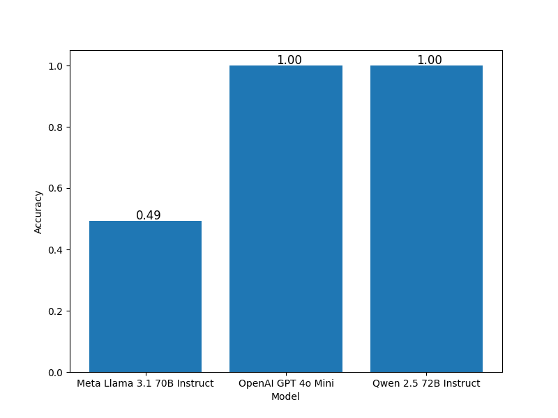
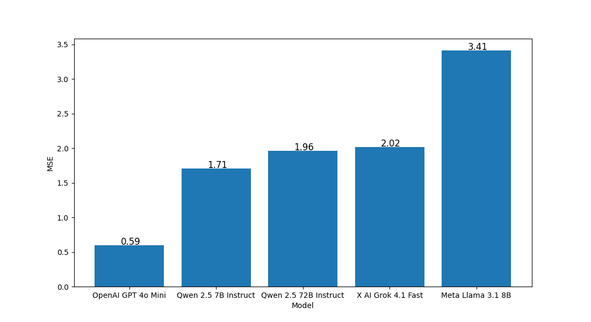
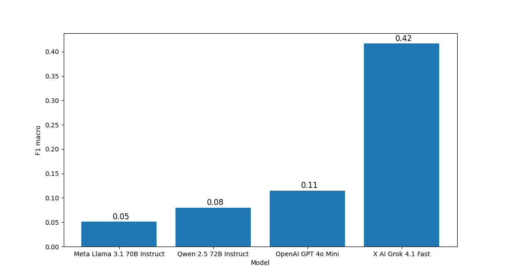

# Overview

This repository documents the approach and results for the completion of three Czech Natural Language Processing (NLP) tasks using pre-trained Large Language Models (LLMs) available through the OpenRouter platform.

The tasks addressed were:

- Sentiment Classification (CSFD): Classifying movie review sentiment (negative/neutral/positive).
- Semantic Text Similarity (STS): Scoring sentence pair similarity on a continuous scale.
- Named Entity Recognition (NER): Identifying and classifying entities in text.

I used provided OpenRouter API key and ran the solution locally. I used at least once each of these models listed below:

- qwen/qwen-2.5-7b-instruct
- meta-llama/llama-3.1-8b-instruct
- qwen/qwen-2.5-72b-instruct
- meta-llama/llama-3.1-70b-instruct
- openai/gpt-4o-mini
- x-ai/grok-4.1-fast

I also experimented a lot with few-shots: since we test the model on test data, every model prompt includes _n_ random samples from train dataset with the correct solution. I ran these models with different _n_ - 0, 3, 5, 10, 20, even 50 one time.

To run the program, first install all Python packages from requirements.txt. Make sure to add your OpenRouter API key to .env file, such as `OPENROUTER_API_KEY="YOUR API KEY"` Then run program with these parameters:

- `--model`: specifies the model available on OpenRouter.
- `--task`: specifies task. Can be `csfd`, `sts`, `ner` or `all`.
- `--few_shot`: specifies how many few shots to use.

Example:

`python main.py --model x-ai/grok-4.1-fast --task sts --few_shot 3`

I set the temperature to be 0, so the output is more deterministic and should be more accurate for these tasks.

# CSFD

When I started implementing solution for this task, I used some small models like `qwen/qwen-2.5-7b-instruct` and only reached something like 30% accuracy. Later I realized that I've been actually testing the model also on first dataset line, which contains information about dataset structure, so all IDs of classifications were shifted by 1. When I fixed this issue (all submissions where this bug is fixed contains `fixed` in its name), the accuracy raised dramaticaly. Here is my best submission:

| Model              | Few Shots | Accuracy | Submission                                                |
| ------------------ | --------- | -------- | --------------------------------------------------------- |
| openai/gpt-4o-mini | 3         | 1.00000  | submission_openai_gpt_4o_mini_3_new_query_fixed.csfd.json |

The first prompt I came up with looked like this (in Czech):

```
Analyzuj sentiment filmové recenze. Klasifikuj jako: 0 (negativní), 1 (neutrální), 2 (pozitivní). Odpověz POUZE číslem.\n\n<few shots>
```

I also came with different query (affected submissions contains `new_query` in its names):

```
Vyhodnoť sentiment filmové recenze pro klasifikaci. Výsledek musí být jedno číslo bez dalšího textu.\n\n
Definice tříd:\n
0 = Negativní (recenze obsahuje silnou nespokojenost, kritiku, výtky nebo zklamání)\n"
1 = Neutrální (informativní komentář nebo smíšené hodnocení bez jasného postoje)\n
2 = Pozitivní (převážně spokojenost, chvála, jednoznačně kladné hodnocení)\n\n
Pokyny:\n
- Ignoruj popis hereckého obsazení, režie či produkce, pokud neobsahují hodnotící soud.\n
- Ironii vyhodnoť podle skutečného sentimentu, ne povrchově.\n
- Pokud jsou v textu pozitivní i negativní části, rozhodni podle celkového tónu.\n
- Pokud není přítomné hodnotící vyjádření, zvol 1.\n\n<few shots>
```

With this prompt and usage of 3 few shot, `gpt-4o-mini` was able to reach 100% accuracy, so did `Qwen 2.5 72B Instruct`. My best implementation of CNN/mean model in exercise 3, where we had to deal with same task, reached only accuracy of about 73% - that makes sense, since CNNs aren't state-of-the-art models for such tasks and their capabilities are limited.

Here are compared best submissions for each of 3 models, that I ran after fixing the dataset first row issue (each of these may have multiple runs with different `--few_shot`, the chart below show best of these runs).



LLama wasn't really good for this task.

# STS

Even when I ran STS experiment for the first time with just `qwen/qwen-2.5-7b-instruct`, the MSE was well below the 2.85 limit specified by assignment. But, as I wanted to reach better results, I tried multiple `--few_shot` and `--model` settings. The best performer looked like this:

| Model              | Few Shots | MSE     | Submission                                         |
| ------------------ | --------- | ------- | -------------------------------------------------- |
| openai/gpt-4o-mini | 3         | 0.59432 | submission_openai_gpt_4o_mini_3_new_query.sts.json |

The best performer model is again `gpt-4o-mini`, and also with 3 few shots.

I stucked with this simple prompt during the process:

```
Ohodnoť sémantickou podobnost dvou vět na stupnici od 0.0 do 6.0. Odpověz POUZE číslem.\n\n<few shots>
```

There's no need to complicate this task more from my point of view.

Also during implementation in NLP exercise 2, where we solved this task using simplier neural networks, the MSE of best performer was 1.805 - here LLMs dominate again.

Here are visualized the best runs of all models that I ran during this task.



Here, the lower the result, the better - so the best models stays left. Interestingly, `Qwen 2.5 7B Instruct` run was little bit better then the 72B Qwen model. Maybe that was just a good luck. LLama's results are bad also for this task.

# NER

This task was the hardest for all models, as I can judge. I firstly came up with this prompt:

```
Jsi expertní NER systém. Přiřaď CNEC tagy (např. B-P, I-P, O) ke každému slovu ve větě. Výstup musí být seznam tagů oddělený mezerami. Délka seznamu tagů musí přesně odpovídat počtu slov.\n\n<few shots>
```

But the results were really bad, as the model had not the tags listed explicitely. I added these tags. Submissions after these change are marked as `with_tags` substring in their names.

```
Jsi expertní NER systém. Přiřaď CNEC tagy (např. B-P, I-P, O) ke každému slovu ve větě. Výstup musí být seznam tagů oddělený mezerami. Délka seznamu tagů musí přesně odpovídat počtu slov.\n\nZde jsou popsány všechy tagy v angličtině:
B-A = Beginning of Numbers in addresses
B-G = Beginning of Geographical names
B-I = Beginning of Institutions
B-M = Beginning of Media names
B-O = Beginning of Artifact names
B-T = Beginning of Time expressions
B-P = Beginning of Personal names
I-A = Inside of Numbers in addresses
I-G = Inside of Geographical names
I-I = Inside of Institutions
I-M = Inside of Media names
I-O = Inside of Artifact names
I-P = Inside of Personal names
I-T = Inside of Time expressions
O = Outside of a named entity\n\n<few shots>
```

As I watched the results, the model showed some understanding of the task, but the maximum F1 macro I was able to get out of the best performer at this point was about 0.08, very low. When I changed the prompt, the score raised to 0.11, which was still pretty poor, but at least some improvement. The prompt looked like this:

```
Jsi přesný NER systém. Pro každé slovo ve větě přiřaď přesně jeden tag podle schématu CNEC. Počet tagů musí přesně odpovídat počtu slov. Výstup je pouze seznam tagů oddělený mezerami, bez dalšího textu.\n\n
Stručný popis tagů:\n
B-P / I-P = osobní jména (lidé)\n
B-G / I-G = geografické názvy (města, státy, hory, řeky)\n
B-I / I-I = instituce (organizace, firmy, úřady)\n
B-O / I-O = artefakty (díla, produkty, objekty)\n
B-M / I-M = mediální názvy (filmy, seriály, knihy, alba)\n
B-T / I-T = časové výrazy (datum, rok, čas)\n
B-A / I-A = čísla v adresách (ulice, popisná čísla)\n
O = mimo jakoukoli pojmenovanou entitu\n\n
Pokyny:\n
- U víceslovných entit začni tagem B- a pokračuj I-.\n
- Pokud si nejsi jistý, použij O.\n
- Nikdy neprodukuj více nebo méně tagů než je slov.\n\n<few shots>
```

I was actually already quite low on credit at this point, so I thought that I'll let the 0.11 F1 macro be and not get points for this task, but then I just looked at openrouter.ai/rankings and tried the most used model, `x-ai/grok-4.1-fast`. The difference was very significant: F1 macro raised to unbelievable 0.41706, just four times more than the second best model. I then tried grok on STS task too (as CSFD was already 100% accurate), but it was worse than the best performers.

| Model              | Few Shots | F1 macro | Submission                                         |
| ------------------ | --------- | -------- | -------------------------------------------------- |
| x-ai/grok-4.1-fast | 3         | 0.41706  | submission_x_ai_grok_4_1_fast_3_with_tags.ner.json |

In cv04, we used different approaches for this task. RNN gave similar result with F1 macro of 0.445, but the rest of models were better - LSTM 0.556, SLAVIC 0.839, CZERT 0.851. On the other hand, these models (and specifically transormer-based SLAVIC and CZERT) were trained on the problem, but LLMs used in this exercise weren't, so the worse result is understandable.

Chart below shows absolute dominance of Grok model in this task. Its results are really impresive, F1 score of 0.42, while the second model, GPT 4o has reached only 0.11. On the other hand, Llama performs poorly also in this task.


# Results

Out of list of models that I've tried, only 2 gave really extraordinaly results: `x-ai/grok-4.1-fast` really suprised me in NER task, where all different models tried failed. `gpt-4o-mini` took the best performer place in both remaining tasks. I was also suprised by Llama model with 70B parameters, which performed really poorly in all of the tasks - I did not expect it.

Not fine-tuned LLMs showed to be effective in sentiment classification and semantic text similarity, but could not compete with task-specific trained model on NER. Also, in case that these models were fine-tuned, we would see much better results for all of these tasks.

Experiments were conducted with `0`, `3`, `5`, `10`, and a costly test with `50` shots, yet `3` was always the best choice for every task. Three clear examples were probably sufficient to teach the model the required input-output mapping and format constraints, without diluting the instruction.

All of 3 required thresholds for model efficiency were met with large gap.
